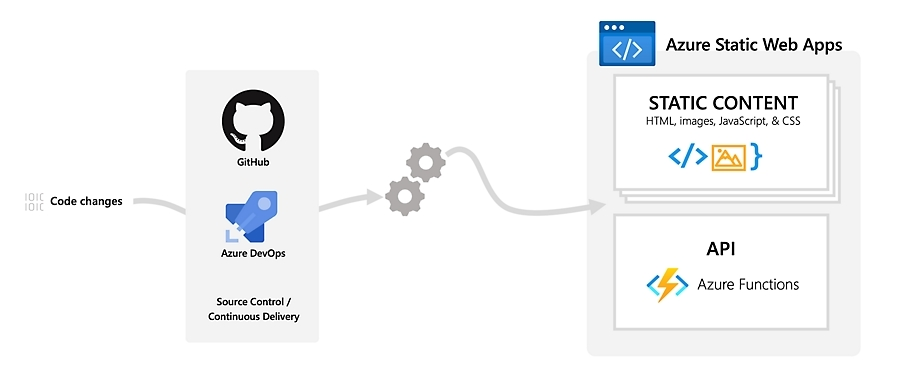

#  Azure Static Web Apps

  

  <h1>🌐Azure Static Web Apps</h1>
  <a href="https://learn.microsoft.com/azure/static-web-apps/get-started-portal?tabs=vanilla-javascript&pivots=github&WT.mc_id=javascript-150001-gllemos">Quickstart</a>
  &nbsp;&nbsp;•&nbsp;&nbsp;
  <a href="https://learn.microsoft.com/azure/static-web-apps/?WT.mc_id=javascript-150001-gllemos">Official Documentation</a>
  &nbsp;&nbsp;•&nbsp;&nbsp;
  <a href="https://www.youtube.com/playlist?list=PLI7iePan8aH5sy4XTvePIB30yBLE4MEp9">Videos</a>
  &nbsp;&nbsp;•&nbsp;&nbsp;
  <a href="https://learn.microsoft.com/en-us/samples/browse/?terms=static%20web%20apps">Samples</a>
  &nbsp;&nbsp;•&nbsp;&nbsp;
  <a href="https://github.com/Azure/static-web-apps/discussions">Community</a>
  &nbsp;&nbsp;•&nbsp;&nbsp;
  <a href="https://twitter.com/AzureStaticApps">Twitter</a>
   
  

## 🚀 Welcome to Azure Static Web Apps!

**[Azure Static Web Apps](https://learn.microsoft.com/azure/static-web-apps/?WT.mc_id=javascript-150001-gllemos)** offers a fast and efficient way to develop and deploy web applications globally! Develop full-stack applications using serverless APIs with ease, security and worldwide scalability. 

## ✨ Key Benefits

- **🌍 Global Hosting:** Bring your content closer to your users with automated geo-distribution worldwide.
- **⚡ Integrated Serverless APIs:** Add dynamic APIs to your app using the power of Azure Functions.
- **🛠️ Streamlined Workflow:** Accelerate your deployment with native integration to GitHub Actions and CI/CD tools.
- **🧪 Automated Staging Environments:** Automatically create staging versions of your app based on pull requests to preview changes before publishing.

## 🚀 Development Features

### 🔹Enhanced Local Experience

Use the **[Visual Studio Code extension](https://marketplace.visualstudio.com/items?itemName=ms-azuretools.vscode-azurestaticwebapps&WT.mc_id=javascript-150001-gllemos)** for a simplified local development experience.

  

### 🔹Full CI/CD Integration

Boost productivity with native workflows for continuous integration (CI) and continuous deployment (CD).

  

### 🔹Global Distribution and Dynamic Scale

Improve global performance with load balancing, SSL offload, and application acceleration using **[Azure Front Door](https://azure.microsoft.com/products/frontdoor?WT.mc_id=javascript-150001-gllemos)**. Build highly scalable serverless APIs using Azure Functions in your preferred language: JavaScript, TypeScript, Python, C#, Java, and PowerShell.

### 🔹Multi-language and Web Framework Support

Deploy your Full-Stack applications in any programming language, including Node.js, Python, .NET, Java, Ruby, PHP, Go, and more. Enjoy built-in support for popular Frontend frameworks like Angular, React, Vue.js, Svelte, and more.

  

## 📚 Documentation and Development Resources

Do you want to learn how to develop and deploy Static Web Apps with Azure Static Web Apps? If so, check out the 5-minute quickstarts: Build your static web app with:

  - [Angular](https://learn.microsoft.com/azure/static-web-apps/deploy-angular?pivots=github&WT.mc_id=javascript-150001-gllemos)
  - [Blazor](https://learn.microsoft.com/azure/static-web-apps/deploy-blazor?WT.mc_id=javascript-150001-gllemos)
  - [React](https://learn.microsoft.com/azure/static-web-apps/deploy-react?pivots=github&WT.mc_id=javascript-150001-gllemos)
  - [Vue](https://learn.microsoft.com/azure/static-web-apps/deploy-vue?pivots=github&WT.mc_id=javascript-150001-gllemos)
  - [Next.js](https://learn.microsoft.com/azure/static-web-apps/nextjs?WT.mc_id=javascript-150001-gllemos)
  - [Nuxt.js](https://learn.microsoft.com/en-us/azure/static-web-apps/deploy-nuxtjs?WT.mc_id=javascript-150001-gllemos)
  - [VuePress](https://learn.microsoft.com/azure/static-web-apps/publish-vuepress?WT.mc_id=javascript-150001-gllemos)

> Didn't see your favorite framework? Don't worry! Check it out our other repository with code samples for various frameworks and programming languages: **[Azure Static Web Apps Samples]()**.

## 🔐 Security and Compliance

Azure Static Web Apps provides robust security features to ensure your applications are secure, reliable, and perform optimally on a global scale. Key security and compliance features include:

- **[Enterprise-Grade Edge](https://learn.microsoft.com/azure/static-web-apps/enterprise-edge?tabs=azure-portal&WT.mc_id=javascript-150001-gllemos)**: Accelerate page loads, enhance security, and optimize reliability with a global presence in 118+ edge locations across over 100 cities. Features include:
  - Caching assets at multiple levels (CDN, DNS, and browser) to reduce latency.
  - Proactive protection against Distributed Denial of Service (DDoS) attacks.
  - Native support for end-to-end IPv6 connectivity and HTTP/2 protocol.
  - Optimized file compression for faster content delivery.

- **[Authentication and Authorization](https://learn.microsoft.com/azure/static-web-apps/authentication-authorization?WT.mc_id=javascript-150001-gllemos)**: Streamlined authentication with built-in support for GitHub and Microsoft Entra ID. Configure custom authentication providers to suit your needs.

- **[Private Endpoint Support](https://learn.microsoft.com/azure/static-web-apps/private-endpoint?WT.mc_id=javascript-150001-gllemos)**: Restrict access to your static web app to your private network using a private endpoint (also known as private link). This ensures that your app is only accessible from within your Azure Virtual Network (VNet), enhancing security and privacy.

- **[Password Protection (Preview)](https://learn.microsoft.com/azure/static-web-apps/password-protection?WT.mc_id=javascript-150001-gllemos)**: Protect your app's pre-production or all environments with password protection to limit access to authorized users only.

- **[Automatic SSL Management](https://learn.microsoft.com/azure/static-web-apps/custom-domain?WT.mc_id=javascript-150001-gllemos)**: SSL certificates are automatically managed and renewed, providing secure HTTPS connections without requiring manual intervention.

- And much more!

These are some features, combined with Azure's comprehensive security framework, ensure that your static web applications are secure, compliant, and optimized for global performance.

## 💰 Flexible Pricing

Azure Static Web Apps offers three plans: **Free**, **Standard**, and **Dedicated (preview)**.

- **Free**: Best for personal projects with essential features like global content distribution, up to 3 staging environments, and managed APIs.
- **Standard**: Suited for production apps, with up to 10 staging environments, custom domains, private endpoints, and a Service Level Agreement (SLA).
- **Dedicated (Preview)**: For enterprise needs, offering regional data residency, more environments, and full control over configurations.

For detailed pricing, visit the [pricing page](https://learn.microsoft.com/azure/static-web-apps/plans?WT.mc_id=javascript-150001-gllemos).

## 🗣️ Product Feedback

If you are already using Azure Static Web Apps and have suggestions for new features or need to report a bug, feel free to open a new issue on our **[GitHub repository](https://github.com/Azure/static-web-apps/issues)**. Your feedback is invaluable in helping us improve the service!

We also encourage you to check out the **[Discussions tab](https://github.com/Azure/static-web-apps/discussions)** in our repository. Here, you can start or join discussions about Azure Static Web Apps to ask questions, share experiences, or learn about the latest features and announcements.

Your input helps us shape the future of Azure Static Web Apps!

## 🤝 Contributing

This project welcomes contributions and suggestions.  Most contributions require you to agree to a
Contributor License Agreement (CLA) declaring that you have the right to, and actually do, grant us
the rights to use your contribution. For details, visit https://cla.opensource.microsoft.com.

When you submit a pull request, a CLA bot will automatically determine whether you need to provide
a CLA and decorate the PR appropriately (e.g., status check, comment). Simply follow the instructions
provided by the bot. You will only need to do this once across all repos using our CLA.

This project has adopted the [Microsoft Open Source Code of Conduct](https://opensource.microsoft.com/codeofconduct/).
For more information see the [Code of Conduct FAQ](https://opensource.microsoft.com/codeofconduct/faq/) or
contact [opencode@microsoft.com](mailto:opencode@microsoft.com) with any additional questions or comments.

🚀 <strong>Get started now and take your app to the next level with <a href="https://learn.microsoft.com/azure/static-web-apps/?WT.mc_id=javascript-150001-gllemos">Azure Static Web Apps</a>!</strong>

